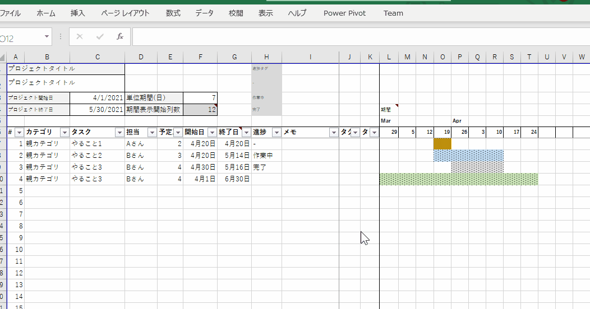

# Excel-GanttChart
 
## 概要
* ガントチャートを動的表示するExcelテンプレート
* GanttChart.xlsx をダウンロードして利用してください。
* 単位期間を変える事で、週単位/日単位など切り替えて表示できます。

* 

## 機能

1. プロジェクト基礎情報
    - プロジェクト名称
    - プロジェクト開始/終了期間

2. タスク登録
    - カテゴリ
    - タスク
    - 担当者
    - 予定工数
    - 開始日
    - 終了日
    - 進捗（完了/作業中/未設定）

