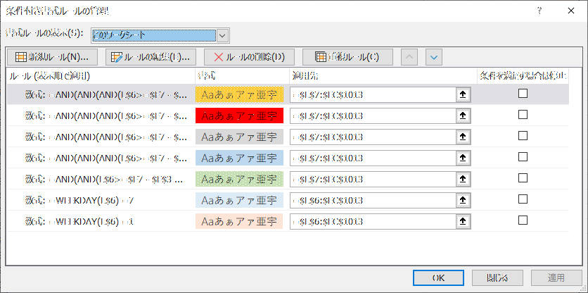

# Excel-GanttChart
 
## 概要
* ガントチャートを動的表示するExcelテンプレート
* [GanttChart.xlsx](GanttChart.xlsx) をダウンロードして利用してください。
* 単位期間を変える事で、週単位/日単位など切り替えて表示できます。

* 

## 機能

1. プロジェクト基礎情報
    - プロジェクト名称
    - プロジェクト開始/終了期間

2. タスク登録
    - カテゴリ
    - タスク
    - 担当者
    - 予定工数
    - 開始日
    - 終了日
    - 進捗（完了/作業中/未設定）

---

## カスタマイズ方法

### 1. 配色管理
* Excelの条件付き書式機能　( ホーム > 条件付き書式 > ルールの管理　> 書式ルールの表示: このワークシート) で色の管理を行っています。
* 以下の図だと、上から順番に 以下の設定になっています。
    1. 開始と終了日が同じの場合はマイルストーンとして、セルの色をオレンジ色に
    1. 進捗が「完了」だと、チャートの色をグレーに
    1. 進捗が「作業中」だと、チャートの色を青に
    1. 進捗が 未設定 だと、チャートの色を緑に
    1. 土曜日は青色に
    1. 日曜日は赤色に

    
    
